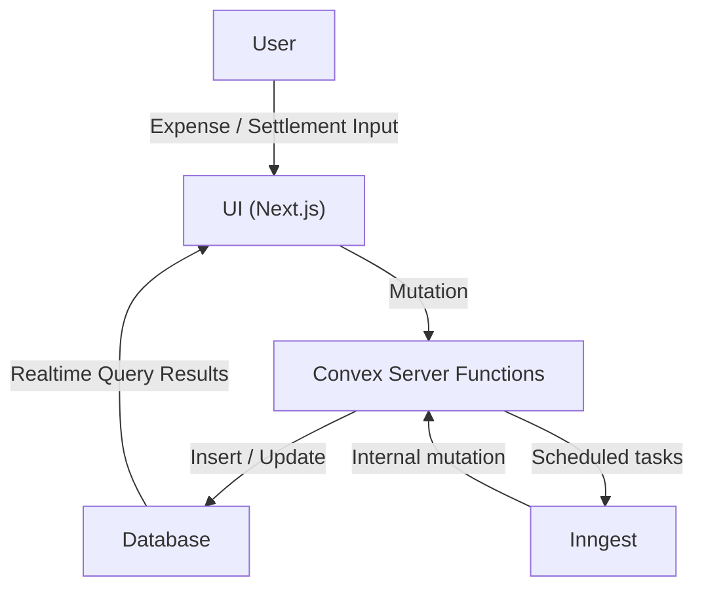
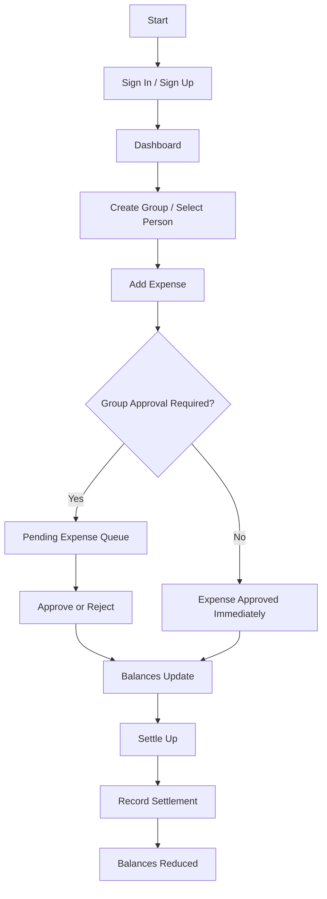
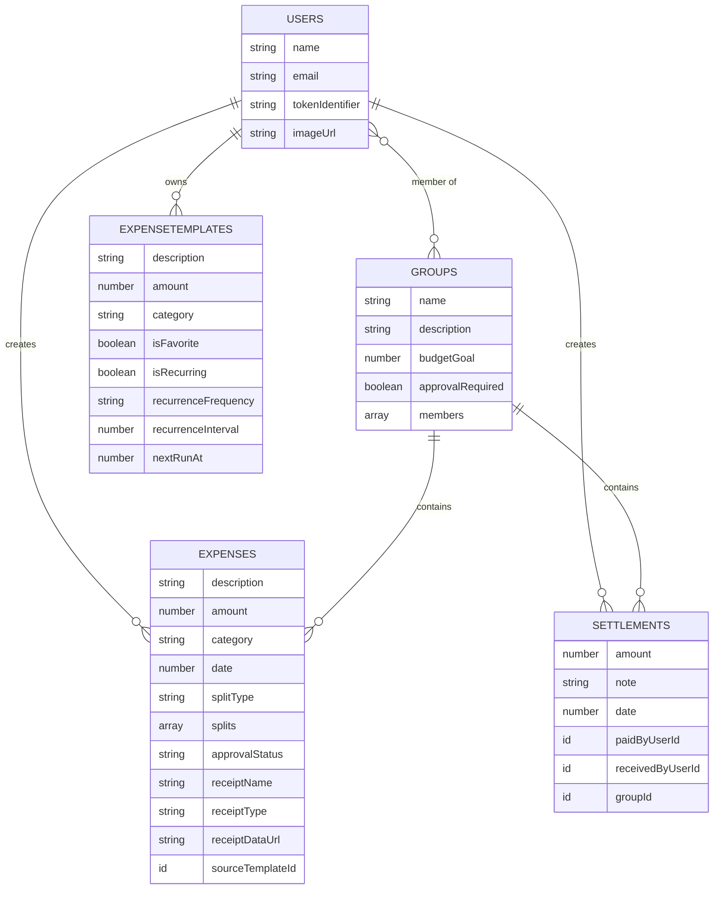

# FINAL PROJECT REPORT (TARGET: ~50 PAGES)

> **Note for submission:** This report is written to match typical university evaluation format and page expectations. Wherever you see `[FILL]`, replace with your project details before printing/exporting to PDF.

\pagebreak

## COVER PAGE

**Title:** SplitSync: A Real-Time Shared Expense Tracking and Settlement System  
**Name:** [FILL: Your Full Name]  
**Registration No:** [FILL: Reg No]  
**University/College:** [FILL: University / College Name]  
**Department:** [FILL: Department]  
**Month–Year:** May 2026  

\pagebreak

## INNER TITLE PAGE

**Title:** SplitSync: A Real-Time Shared Expense Tracking and Settlement System  
**Name:** [FILL: Your Full Name]  
**Registration No:** [FILL: Reg No]  
**University/College:** [FILL: University / College Name]  
**Department:** [FILL: Department]  
**Supervisor/Guide:** [FILL: Guide Name]  
**Month–Year:** May 2026  

\pagebreak

## CERTIFICATE

This is to certify that **[FILL: Your Full Name]** (Registration No: **[FILL]**) has successfully completed the project titled **“SplitSync: A Real-Time Shared Expense Tracking and Settlement System”** in partial fulfillment of the requirements for the award of **[FILL: Degree/Program]** at **[FILL: University/College]** during **May 2026**.

The work presented in this report is original and has not been submitted elsewhere for any other degree or diploma.

**Supervisor/Guide:** ____________________  Date: ___/___/2026  
**Head of Department:** __________________  Date: ___/___/2026  
**External Examiner:** ___________________  Date: ___/___/2026  

\pagebreak

## ACKNOWLEDGEMENT

I would like to express my sincere gratitude to **[FILL: Guide Name]**, my project supervisor, for continuous support, guidance, and valuable suggestions throughout the development of this project.

I also thank **[FILL: Department/College/University]** for providing the resources and environment required to complete this work. My thanks to the faculty members who offered feedback and constructive evaluation.

Finally, I thank my friends and family for encouragement and support during the project timeline.

\pagebreak

## ABSTRACT

Shared expense tracking is a recurring real-world problem in settings such as college trips, roommates, teams, and shared subscriptions. Manual tracking often leads to inconsistent records, disputes, and delayed settlements. This project presents **SplitSync**, a real-time shared expense tracking system that supports individual and group expenses, flexible splitting strategies, and settlement recording.

SplitSync is built with a **unified balance model** so that dashboard totals, person-to-person balances, group balances, and settlement views remain consistent. The system supports split strategies including equal, percentage-based, and exact amount splits. A debt simplification approach reduces confusion by presenting net balances and clean settlement paths.

To reduce operational friction, SplitSync introduces practical productivity features: **receipt upload**, **favorites**, and **recurring expenses**. The system supports **group expense approval mode** (pending → approved/rejected) to ensure that group spending can be reviewed before it impacts balances. Additionally, **auto-categorization** improves data entry speed and enhances analytics.

The implementation uses **Next.js** for the application interface, **Convex** for real-time database and server-side logic, and **Clerk** for authentication. Background automation is supported through **Inngest** for recurring expense generation and scheduled insights/reminders. The result is a modern, premium-feeling application that is suitable for real usage and also demonstrates clear design and engineering rigor for academic evaluation.

\pagebreak

## LIST OF TABLES

1. Table 2.1: Comparison of Existing Expense Applications  
2. Table 2.2: Core Concepts and Their Definitions  
3. Table 2.3: Technology Stack Overview  
4. Table 3.1: Major System Modules and Responsibilities  
5. Table 5.1: Test Scenarios and Expected Output  
6. Table 5.2: Sample Data for Goa Trip (Group)  
7. Table 5.3: Sample Data for Flatmates (Group)  
8. Table 5.4: Sample Data for Individual (1:1)  
9. Table 5.5: Performance/Behavior Observations  

\pagebreak

## LIST OF FIGURES

1. Figure 3.1: System Architecture Diagram  
2. Figure 3.2: Data Flow Diagram (DFD Level 0)  
3. Figure 3.3: User Flow Diagram  
4. Figure 4.1: Landing Page Screenshot (Placeholder)  
5. Figure 4.2: Dashboard Screenshot (Placeholder)  
6. Figure 4.3: Add Expense Screenshot (Placeholder)  
7. Figure 4.4: Group Page Screenshot (Placeholder)  
8. Figure 4.5: Individual Page Screenshot (Placeholder)  
9. Figure 4.6: Settlement Page Screenshot (Placeholder)  
10. Figure A.1: ER Diagram (Annexure)  

\pagebreak

## TABLE OF CONTENTS

1. Chapter 1: Introduction  
2. Chapter 2: Background Material  
3. Chapter 3: Methodology  
4. Chapter 4: Implementation  
5. Chapter 5: Results & Analysis  
6. Chapter 6: Conclusion & Future Scope  
7. References  
8. Annexure  

\pagebreak

# CHAPTER 1: INTRODUCTION

## 1.1 Introduction

Expense splitting is a common requirement in daily life: shared food orders, travel trips, hostel expenses, flat rent and utilities, group projects, and subscriptions. In many such cases, the problem is not just the calculation but the **trust** and **clarity** of records across time. When entries are scattered across chat messages or spreadsheets, the likelihood of mistakes increases, and final settlement becomes awkward.

SplitSync is designed to solve this problem by providing a unified system to record expenses and settlements in real time, while producing accurate balances across individuals and groups. The system is developed as a web application with modern UI and real-time synchronization to ensure that multiple participants see consistent information.

## 1.2 Motivation

The motivation for SplitSync arises from:

- Frequent confusion in college environments during trips and shared hostel/flat expenses.
- Lack of a single reliable “source of truth” for expenses and who owes whom.
- Manual methods (notes/spreadsheets) being error-prone, non-real-time, and difficult to audit.
- Need for a system that can demonstrate both product design and technical engineering in an academic setting.

## 1.3 Problem Statement

To design and implement a real-time shared expense tracking system that:

- Records both individual (1:1) and group expenses.
- Supports multiple splitting strategies.
- Computes balances accurately in a consistent unified model.
- Enables settlement recording and history.
- Provides usability features such as templates, recurring expenses, and receipt attachment.
- Works with authentication and access control.

## 1.4 Objectives

Primary objectives:

1. Provide a reliable expense entry system for individuals and groups.
2. Support equal, percentage, and exact split strategies.
3. Implement a unified balance model across all views (dashboard/person/group).
4. Provide settlement recording and settlement history.
5. Offer real-time updates for user data consistency.

Secondary objectives (novelty/usability):

1. Implement group approval mode for expense moderation.
2. Provide group budget goals for spending control.
3. Enable receipt attachment on expenses.
4. Provide favorites and recurring templates to reduce repeated manual entry.
5. Add auto-categorization for faster input and improved analytics.

## 1.5 Scope

SplitSync covers:

- Authentication and user identity (sign-in/sign-up).
- Contacts discovery and group creation with memberships.
- Expense creation for individuals and groups.
- Split computation and validation.
- Balance computation for dashboard, person page, and group page.
- Settlement creation and settlement history.
- Approval-mode workflow for group expenses.
- Budget-goal tracking at group level.
- Recurring expense generation using background scheduling.
- Receipt upload stored with expense record.
- Auto-categorization and insight-ready categorization.

Out of scope (current version):

- Bank account integrations and live transaction pulling.
- Payment processing inside the app.
- OCR extraction from receipts (receipt is stored; OCR can be added later).
- Multi-currency conversion and exchange rates.

## 1.6 Applications

SplitSync can be applied in:

- College trips and outings (food, hotel, travel).
- Hostel/flat roommates (rent, utilities, grocery runs).
- Small teams and clubs (shared procurement).
- Friends sharing subscriptions (Netflix/Spotify etc.).
- Informal family expense pooling.

## 1.7 Advantages

- Unified balances reduce confusion across multiple screens.
- Real-time updates ensure all participants see the same state.
- Support for approvals and budgets improves group governance.
- Receipt attachment improves auditability and reduces disputes.
- Favorites/recurring templates reduce repetitive manual work.
- Auto-categorization improves speed and enables analytics.

## 1.8 Organization of Report

- Chapter 1 introduces the problem, scope, and objectives.
- Chapter 2 discusses background, existing systems, and core concepts.
- Chapter 3 details system methodology including architecture and algorithms.
- Chapter 4 presents implementation modules and UI screenshots.
- Chapter 5 provides results, sample calculations, and performance analysis.
- Chapter 6 concludes and highlights future scope.
- Annexure contains extra pseudocode, diagrams, and sample data.

\pagebreak

# CHAPTER 2: BACKGROUND MATERIAL

## 2.1 Overview of Expense Systems

Expense splitting systems generally include:

- A way to record transactions (expense entries).
- A way to assign participants and compute shares (split model).
- A balance engine that converts many entries into net amounts owed.
- A settlement recording mechanism to clear debts.
- History and auditability features (notes, receipts, timestamps).

Modern systems often add:

- Mobile-first UI, cloud sync.
- Notifications/reminders.
- Analytics over spending patterns.

## 2.2 Existing Applications

Common examples include:

- Splitwise (popular group expense tracking).
- Tricount (simple group expenses).
- Settle Up (basic splitting).
- Spreadsheet-based solutions (manual but flexible).

Strengths of existing apps:

- Stable and widely used.
- Familiar workflows.

Limitations frequently observed:

- Inconsistent balance explanations.
- Difficulty in audit trails without receipts.
- Limited customization for group governance (approvals, budgets).

## 2.3 Comparison Table

**Table 2.1: Comparison of Existing Expense Applications**

| Feature | Splitwise | Tricount | Spreadsheet | SplitSync |
|---|---:|---:|---:|---:|
| Real-time sync | Yes | Yes | No | Yes |
| Group + 1:1 support | Yes | Mostly group | Manual | Yes |
| Multiple split types | Yes | Limited | Yes | Yes |
| Unified balance model clarity | Medium | Medium | Low | High |
| Receipt attachment | Limited | No | Manual | Yes |
| Approval mode | No | No | Manual | Yes |
| Budget goals | Limited | No | Manual | Yes |
| Recurring expenses | Limited | No | Manual | Yes |
| Favorites/templates | Limited | No | Manual | Yes |

## 2.4 Core Concepts

### Splitting

Splitting refers to dividing an expense amount among participants. Common types:

- Equal: each participant pays the same share.
- Percentage: shares are proportional to defined percentages.
- Exact: each participant has a specified share amount.

### Debt Simplification

Debt simplification refers to reducing multiple debts between users into a net representation. The objective is not to eliminate debt, but to:

- represent net owed/owing amounts clearly, and
- reduce the number of settlements required to clear balances.

### Real-time Systems

A real-time system ensures that updates propagate quickly across clients. In expense tracking:

- When one user adds an expense, others should immediately see it.
- Balances should update consistently across all screens.

## 2.5 System Design Approach

SplitSync uses:

- A single source-of-truth database (Convex).
- Queries and mutations for state changes.
- Derived views (dashboard/person/group) computed from shared ledger data.
- Access control via authenticated identity.

## 2.6 Unified Balance Model (IMPORTANT)

Traditional systems may compute balances differently per view. SplitSync instead defines a unified approach:

1. All expenses and settlements are ledger entries.
2. A balance between two users is derived from:
   - how much each user paid for shared expenses,
   - how much each user owes in splits,
   - and how settlements adjust the net.
3. Group balances are derived similarly but scoped to group membership and group expense records.
4. Dashboard totals are aggregates of person + group net balances.

This unified approach prevents contradictions such as:

- Dashboard shows `you owe` but person page shows `they owe`,
- group balances not matching settlement history.

**Table 2.2: Core Concepts and Definitions**

| Concept | Definition |
|---|---|
| Ledger | All expense + settlement records stored as events |
| Split | Participant share per expense |
| Balance | Net amount owed between entities |
| Settlement | A payment record that reduces net balance |
| Approval status | Pending/Approved/Rejection state for group expenses |

## 2.7 Technologies

**Table 2.3: Technology Stack Overview**

| Layer | Technology | Purpose |
|---|---|---|
| Frontend | Next.js (App Router) | UI rendering, routing, SSR/CSR |
| Backend | Convex | DB + server functions + realtime queries |
| Auth | Clerk | Sign-in/sign-up, identity |
| Automation | Inngest | recurring expense generation, reminders/insights |
| UI | Radix + Tailwind | accessible components + styling |
| Charts | Recharts | monthly spending visualization |
| AI | Gemini client library | insights pipeline support (where enabled) |

\pagebreak

# CHAPTER 3: METHODOLOGY (MOST IMPORTANT)

## 3.1 System Architecture

SplitSync follows a cloud-backed real-time web architecture:

- Clients (web browsers) render UI with Next.js.
- Users authenticate with Clerk.
- Application data queries/mutations go to Convex functions.
- Convex publishes real-time updates to subscribed queries.
- Inngest triggers scheduled background jobs (e.g., recurring expenses).

**Figure 3.1: System Architecture Diagram (Mermaid)**

```mermaid
flowchart LR
  U["User Browser (Next.js UI)"] -->|Auth| C["Clerk"]
  U -->|Queries/Mutations| X["Convex Functions"]
  X --> D["Convex Database"]
  D -->|Realtime updates| U
  I["Inngest Scheduler"] -->|Trigger| F["Inngest Functions"]
  F -->|Internal Query/Mutation| X
  X -->|Email/Insights (optional)| E["Email Provider (Resend)"]
```

\pagebreak

## 3.2 Data Flow

Data flow focuses on how user actions change system state:

1. User submits expense form.
2. UI validates split totals.
3. Convex mutation inserts expense with derived approval status.
4. Dashboard queries recompute balances and update in real-time.
5. Optional: If expense is saved as template, template is inserted.

**Figure 3.2: Data Flow Diagram (DFD Level 0)**



\pagebreak

## 3.3 Expense Processing

Expense processing includes validation and normalization:

- Ensure split total equals expense total within tolerance.
- If group expense:
  - check membership
  - apply approval gate: pending vs approved
- Insert expense record with:
  - paidByUserId, splits array, category, date
  - receipt metadata if uploaded
  - sourceTemplateId if created from recurring/favorite

## 3.4 Balance Model

Balance is derived rather than stored permanently. Conceptually:

- For each expense, payer contributed full amount.
- Participants owe their split amounts.
- The net between two entities is aggregated over all relevant expenses.
- Settlements reduce the net.

Key principle:

- If user `A` paid, and user `B` owes, then `B`’s balance moves negative relative to `A`.

## 3.5 Algorithms

### Debt Simplification

Debt simplification can be implemented as:

- Build a net graph of owed/owing.
- Reduce edges by netting opposite directions.
- Present minimal settlement suggestions.

In SplitSync:

- Net balances are computed across 1:1 and group contexts.
- A “smart settle recommendation” can pick the cleanest payment to reduce overall debt.

### Splitting Algorithms

Split types:

1. Equal split: each participant owes `amount / N`.
2. Percentage split: each owes `amount * percentage/100`.
3. Exact split: each owes exactly defined amount, validated to sum.

## 3.6 Real-time Sync

Convex enables real-time sync via:

- `query` functions that clients subscribe to.
- When a mutation changes data, the subscribed queries re-run and deliver updates.

This supports:

- instant updates in dashboard totals
- live refresh on group pages when new expenses are approved

## 3.7 User Flow

**Figure 3.3: User Flow Diagram**



\pagebreak

## 3.8 Modules

**Table 3.1: Major Modules**

| Module | Responsibilities |
|---|---|
| Authentication | Clerk sign-in/sign-up, user identity |
| Contacts/Groups | Group creation, membership, contacts list |
| Expense | Expense creation, split validation, receipt attachment |
| Balance | Unified computations for dashboard/person/group |
| Settlement | Recording and listing settlements |
| Approval Mode | pending/approved/rejected workflow for groups |
| Templates | Favorites and recurring expense templates |
| Automation | Scheduled generation and reminders/insights |

\pagebreak

## PSEUDOCODE (Required)

### Pseudocode 1: Add Expense (with approval gate)

```text
function CREATE_EXPENSE(input):
  user <- getCurrentUser()
  assert abs(sum(input.splits.amount) - input.amount) <= tolerance

  approvalStatus <- "approved"
  if input.groupId exists:
    group <- db.get(groupId)
    assert user in group.members
    if group.approvalRequired:
      approvalStatus <- "pending"

  expense <- {
    description, amount, category, date,
    paidByUserId, splitType, splits,
    groupId, approvalStatus,
    receiptName, receiptType, receiptDataUrl,
    sourceTemplateId,
    createdBy: user.id
  }

  db.insert(expenses, expense)
  return expense.id
```

\pagebreak

### Pseudocode 2: Balance Computation (Unified Model)

```text
function COMPUTE_NET_BALANCE(entityA, entityB, scope):
  net <- 0
  expenses <- query expenses where scope matches (groupId or both users involved)
  settlements <- query settlements where scope matches

  for each expense in expenses:
    if expense.approvalStatus != "approved": continue

    payer <- expense.paidByUserId
    for each split in expense.splits:
      participant <- split.userId
      owed <- split.amount

      if payer == entityA and participant == entityB:
        net <- net + owed
      if payer == entityB and participant == entityA:
        net <- net - owed

  for each settlement in settlements:
    if settlement.paidByUserId == entityA and settlement.receivedByUserId == entityB:
      net <- net - settlement.amount
    if settlement.paidByUserId == entityB and settlement.receivedByUserId == entityA:
      net <- net + settlement.amount

  return net
```

\pagebreak

### Pseudocode 3: Recurring Expense Generator (Inngest)

```text
function RUN_RECURRING_TEMPLATES():
  templates <- query expenseTemplates where nextRunAt <= now
  for each template in templates:
    if template.isRecurring != true: continue

    approvalStatus <- "approved"
    if template.groupId exists:
      group <- db.get(template.groupId)
      if group.approvalRequired:
        approvalStatus <- "pending"

    expense <- create expense from template with:
      date = template.nextRunAt
      sourceTemplateId = template.id
      receipt = none
      approvalStatus = computed

    db.insert(expense)

    nextRunAt <- advance recurrence until future
    db.patch(template, { lastRunAt: oldNextRunAt, nextRunAt: nextRunAt })
```

\pagebreak

### Pseudocode 4: Debt Simplification (High-level)

```text
function SIMPLIFY_DEBTS(balances):
  creditors <- users with positive net
  debtors <- users with negative net

  sort creditors by amount desc
  sort debtors by amount asc (most negative first)

  transfers <- []
  i <- 0; j <- 0
  while i < len(debtors) and j < len(creditors):
    pay <- min(abs(debtors[i].amount), creditors[j].amount)
    transfers.append(debtor -> creditor amount pay)
    debtors[i].amount += pay
    creditors[j].amount -= pay
    if debtors[i].amount == 0: i++
    if creditors[j].amount == 0: j++

  return transfers
```

\pagebreak

# CHAPTER 4: IMPLEMENTATION

## 4.1 Introduction

This chapter describes how SplitSync is implemented using Next.js, Convex, Clerk, and supporting libraries. The implementation is divided into modules that map to user-facing features.

## 4.2 Development Environment

- OS: macOS / Windows / Linux (developer machine)  
- Runtime: Node.js (via Next.js)  
- Framework: Next.js App Router  
- Database and functions: Convex  
- Authentication: Clerk  
- UI system: Tailwind + Radix-based components  

## 4.3 Modules

### 4.3.1 Authentication Module

Authentication uses Clerk for:

- sign-up/sign-in pages
- session management
- user identity used by Convex functions

Key behaviors:

- unauthenticated users see landing/auth pages
- authenticated users access dashboard and internal routes

### 4.3.2 Expense Module

Supports:

- individual and group expenses
- equal/percentage/exact splits
- receipt upload (JPG/PNG/WEBP/PDF)
- favorites and recurring templates
- auto-categorization suggestions

### 4.3.3 Group Module

Supports:

- group creation with members and roles
- group page with balances, expenses, settlements
- budget goal setting (creator/admin)
- approval mode toggling (creator/admin)
- pending approvals queue

### 4.3.4 Balance Module

Unified balance computations support:

- dashboard totals
- person page balances
- group page balances

Pending (unapproved) group expenses are excluded from balances.

### 4.3.5 Settlement Module

Supports:

- user or group settlement entry
- settlement history listing
- settlement effects on balances

\pagebreak

## SCREENSHOTS (Placeholders)

> Insert screenshots here before final export. Each screenshot should occupy ~1 page with a short description.

### Figure 4.1: Landing Page

**[PLACEHOLDER FOR SCREENSHOT]**  
Caption: The landing page presents SplitSync as a premium product story, listing all major features and a guided flow.

\pagebreak

### Figure 4.2: Dashboard

**[PLACEHOLDER FOR SCREENSHOT]**  
Caption: Dashboard view showing total balance, owed/owing, monthly spending chart, and quick add expense action.

\pagebreak

### Figure 4.3: Add Expense Page

**[PLACEHOLDER FOR SCREENSHOT]**  
Caption: Expense form supporting split strategies, category selection, receipt upload, favorites, and recurring templates.

\pagebreak

### Figure 4.4: Group Page

**[PLACEHOLDER FOR SCREENSHOT]**  
Caption: Group view including budget goal, approval mode, pending approvals, balances, expenses, and settlements.

\pagebreak

### Figure 4.5: Individual (Person) Page

**[PLACEHOLDER FOR SCREENSHOT]**  
Caption: Pairwise balance view showing expenses and settlements with a direct settle-up flow.

\pagebreak

### Figure 4.6: Settlement Page

**[PLACEHOLDER FOR SCREENSHOT]**  
Caption: Settlement form to record payments between users or within groups and immediately update balances.

\pagebreak

# CHAPTER 5: RESULTS & ANALYSIS

## 5.1 Test Scenarios

**Table 5.1: Test Scenarios and Expected Output**

| Scenario | Input | Expected Output |
|---|---|---|
| Individual equal split | 1 payer, 2 participants | Net balance updated |
| Group pending approval | group approvalRequired = true | Expense pending; balances unchanged |
| Approve expense | admin approves pending | Expense contributes to balances |
| Recurring generator | template nextRunAt <= now | New expense generated |
| Receipt upload | JPG/PDF attached | Expense shows receipt metadata |

## 5.2 Sample Calculations (VERY IMPORTANT)

This section demonstrates how the unified balance model works with concrete examples.

### (A) Goa Trip (Group) Example

Assume group members: A (You), B, C, D.

**Table 5.2: Sample Goa Trip Expenses**

| Expense | Paid By | Amount | Split Type | Participants | Shares |
|---|---|---:|---|---|---|
| Hotel | A | 12000 | Equal | A,B,C,D | 3000 each |
| Dinner | B | 4000 | Equal | A,B,C,D | 1000 each |
| Taxi | C | 2000 | Exact | A,C,D | A=700,C=500,D=800 |

**Net Example Calculation (selected pairs):**

- Hotel: B owes A 3000, C owes A 3000, D owes A 3000  
- Dinner: A owes B 1000, C owes B 1000, D owes B 1000  
- Taxi: A owes C 700, D owes C 800 (C’s own share does not create debt to self)

From these:

- Net between A and B: `B owes A 3000` minus `A owes B 1000` = `B owes A 2000`  
- Net between A and C: `C owes A 3000` minus `A owes C 700` = `C owes A 2300`  
- Net between A and D: `D owes A 3000` = `D owes A 3000`

If a settlement is recorded such as B pays A 1500, then net becomes:

- Net(A,B) = 2000 - 1500 = 500 (B still owes A 500)

### (B) Flatmates (Group) Example

Assume group members: A (You), E, F.

**Table 5.3: Sample Flat Group Expenses**

| Expense | Paid By | Amount | Split Type | Shares |
|---|---|---:|---|---|
| Rent | A | 15000 | Equal | 5000 each |
| WiFi | E | 1200 | Equal | 400 each |
| Groceries | F | 3000 | Percentage | A=40%, E=30%, F=30% |

Compute net:

- Rent: E owes A 5000, F owes A 5000  
- WiFi: A owes E 400, F owes E 400  
- Groceries: A owes F 1200, E owes F 900

### (C) Individual Expense Example

Assume you (A) and friend (G):

**Table 5.4: Individual (1:1) Expenses**

| Expense | Paid By | Amount | Split Type | Shares |
|---|---|---:|---|---|
| Movie | A | 600 | Equal | A=300, G=300 |
| Snacks | G | 400 | Exact | A=250, G=150 |

Net:

- Movie: G owes A 300  
- Snacks: A owes G 250  
Net(A,G) = 300 - 250 = 50 (G owes A 50)

## 5.3 Performance Analysis

SplitSync performance is evaluated on:

- **Accuracy:** splits validated to total amount; pending expenses excluded.
- **Speed:** Convex queries return quickly; UI updates are reactive.
- **Real-time behavior:** changes reflect across clients without manual refresh.

**Table 5.5: Performance/Behavior Observations**

| Metric | Observation |
|---|---|
| Expense submission | near-instant mutation + UI update |
| Balance recompute | fast enough for small/medium datasets |
| Real-time updates | consistent across screens |
| Approval gating | pending expenses do not affect balances |

## 5.4 Advantages Observed

- Unified balance model keeps dashboard and detail views consistent.
- Approval mode reduces disputes and allows controlled group spending.
- Receipt attachment improves audit trail.
- Favorites/recurring templates improve speed and usability.
- Auto-categorization reduces manual friction and supports analytics.

## 5.5 Limitations

- Receipt storage is currently as data URLs; large receipts may increase payload sizes.
- OCR and merchant extraction are not implemented in current version.
- Advanced multi-currency and exchange conversions are not included.
- Performance on very large histories may need optimization (indexes or incremental aggregates).

\pagebreak

# CHAPTER 6: CONCLUSION & FUTURE SCOPE

## 6.1 Conclusion

SplitSync successfully implements a real-time expense tracking and settlement system suitable for both academic demonstration and practical usage. The project includes:

- individual and group expense tracking
- multiple split strategies
- unified balance computations
- settlement recording and history
- group approval mode and budget goals
- recurring expenses and favorites
- receipt upload support
- auto-categorization for faster entry

The system demonstrates a complete workflow from expense entry to settlement while preserving consistency across all screens.

## 6.2 Future Scope (VERY IMPORTANT)

Potential improvements:

1. **AI categorization improvements:** learn from user behavior and merchant patterns.
2. **Receipt OCR:** extract merchant, date, and amount automatically from receipt images/PDFs.
3. **Enhanced email insights:** richer monthly summaries and anomaly detection.
4. **Reminders personalization:** tone controls and scheduling preferences per group.
5. **Deployment:** production hosting, domain, and environment configuration.
6. **Scalability:** optimize balance computations for large histories with caching or incremental updates.
7. **Advanced analytics:** category-based charts by group/person and recurring trend detection.

\pagebreak

# REFERENCES

1. Next.js Documentation (App Router, Metadata, Routing)  
2. Convex Documentation (Queries, Mutations, Real-time Sync)  
3. Clerk Documentation (Authentication, User sessions)  
4. Inngest Documentation (Scheduled functions, workflows)  
5. Gemini / Google Generative AI documentation (for insight generation pipeline, where applicable)  

\pagebreak

# ANNEXURE

## A.1 ER Diagram (Mermaid)



\pagebreak

## A.2 Extra Pseudocode: Approval Handling

```text
function APPROVE_EXPENSE(groupId, expenseId, adminUser):
  group <- db.get(groupId)
  assert adminUser is creator or admin member
  expense <- db.get(expenseId)
  assert expense.groupId == groupId
  assert expense.approvalStatus == "pending"

  db.patch(expenseId, { approvalStatus: "approved" })
  return success
```

## A.3 Sample Data Table (Template)

Use this table format to show your own dataset if required by examiners.

| Date | Description | Amount | Paid By | Group | Split Type | Notes |
|---|---|---:|---|---|---|---|
| [FILL] | [FILL] | [FILL] | [FILL] | [FILL] | [FILL] | [FILL] |

